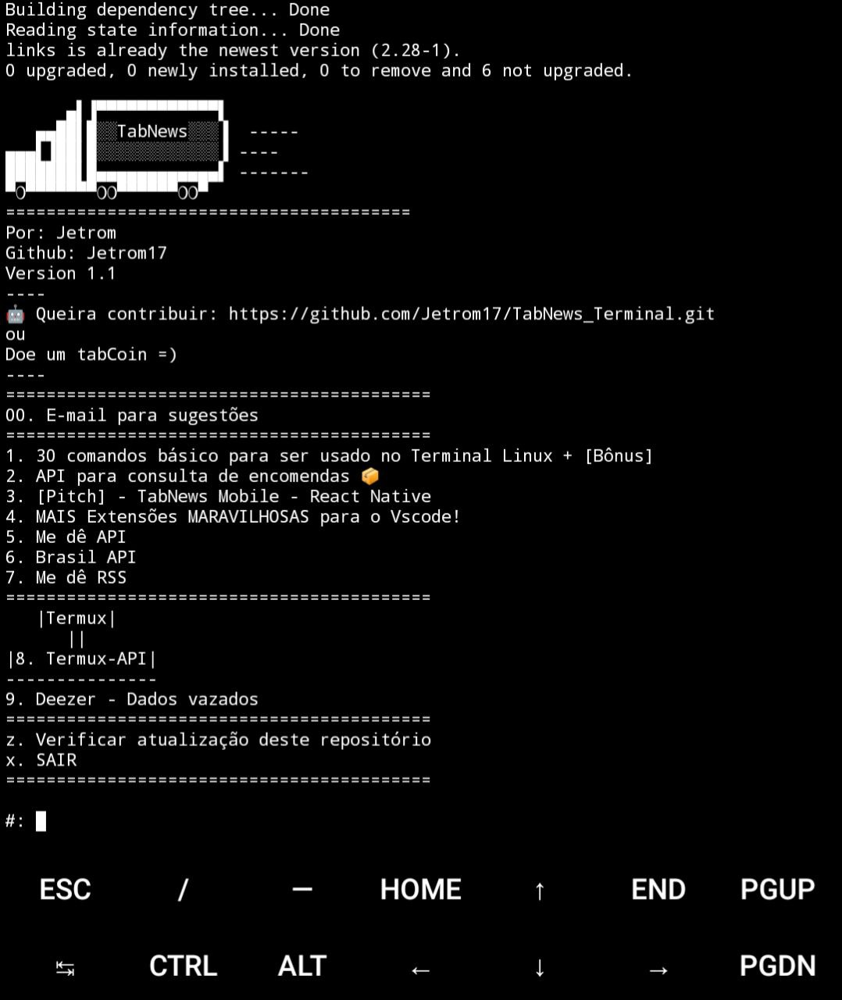
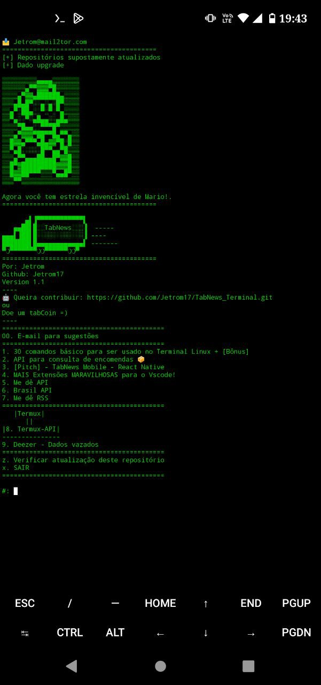

# TabNews_Terminal

```
      ▄▌▐▀▀▀▀▀▀▀▀▀▀▀▀▌
   ▄▄██▌█░░TabNews░░░▐
▄▄▄▌▐██▌█░░░V:1.1░░░░▐
███████▌█▄▄▄▄▄▄▄▄▄▄▄▄▌
▀❍▀▀▀▀▀▀▀❍❍▀▀▀▀▀▀❍❍▀
```


### Changelog:

- [1.0](https://www.tabnews.com.br/Jetrom/tab-py)

### Objetivo?

- Criado para facilitar a busca no TabNews pelo Terminal, sendo os selecionados os **top 8**. Em vez de entrar no seu browser, digitar para navegar no TabNews, apenas para pegar a API... Com `tab.py` é possível acessar rapidamente em alguns cliques e de forma offline, por exemplo. Offline em alguns pontos, essa ferramenta está na versão 1.0 com cerca de 144 linhas, podendo ser acrescentado futuramente. Artigos precisam de acesso a internet para ler. Imagens ou gifs, não são carregados, apenas textos. Tudo isso carregado no Terminal. Rápido, seguro e limpo.
#

<details><summary>Como instalo?</summary>

```bash
git clone https://github.com/Jetrom17/TabNews_Terminal.git && cd TabNews_Terminal && ls && python3 tab.py
```
`git clone` clonando o repositório. `cd` entrando no diretório da pasta. `ls` Exibindo uma lista o que há dentro da pasta. `python3` Executar arquivos ".py".

> Para Linux (Mint), releia a anterior para Termux, e substitue `pkg` para `apt`. 

Exemplo: `pkg update` ---> `apt update`

> ⚠️ Não tem `apt`? 

<details><p>Como instalar o apt?

Se você não tem o apt instalado no seu sistema operacional baseado em Debian, é provável que ele não esteja instalado por padrão. Isso pode ser porque você está usando um sistema operacional baseado em Debian que não inclui o apt ou porque o apt foi removido do sistema por algum motivo.

Se você estiver usando um sistema operacional baseado em Debian que não inclui o apt, você pode instalá-lo manualmente seguindo os seguintes passos:

Baixe o arquivo de instalação do apt a partir do site do projeto: https://apt.alioth.debian.org/
Descompacte o arquivo baixado em um diretório de sua escolha.
Abra um terminal e navegue até o diretório onde você descompactou o arquivo.
Digite o seguinte comando para instalar o apt:
Copy code
`sudo make install`
Isso deve instalar o apt no seu sistema operacional. Depois disso, você poderá usar o apt para gerenciar pacotes de software no sistema, como expliquei na minha resposta anterior.

Se o apt foi removido do seu sistema operacional por algum motivo, você pode tentar recuperá-lo usando o comando apt-get para instalá-lo novamente. No entanto, é possível que você precise instalar alguns outros pacotes antes de poder usar o `apt-get` para instalar o apt. Se você estiver enfrentando esse problema, é recomendável procurar ajuda em fóruns ou comunidades online especializadas em sistemas operacionais baseados em Debian.

@ChatGPT</p></details>
</details>

#
# O que há de novo?

- Se pedido meu e-mail para contato, terá exebição do Super Mario!
- Novos top 7 de Janeiro de 2023.
- Utilização experimental do Termux-API.
- Booleana para verificar dependências.
- "z" uso para verificar atualizações em experimental.

<details><summary>Screenhost</summary>


</details>

#
Lembrando que o meu script em python é open source 🤲 podes bifurcar no meu repositório no Github, podendo contribuir ou modificar para seu ou sendo outro tema (Não TabNews).
